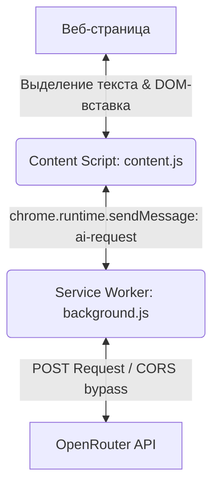

# Техническое описание проекта: AI Text Improver

AI Text Improver — это браузерное расширение для Google Chrome (Manifest V3), предназначенное для интеллектуального редактирования и исправления орфографии, грамматики и пунктуации выделенного текста на веб-страницах.

## 🛠 Архитектура расширения

Проект разделен на три изолированные среды выполнения в соответствии с моделью безопасности Chrome Extensions Manifest V3:



### 1. Скрипт контента (`content.js`)
* Запускается в контексте веб-страницы.
* **Обнаружение выделения (Поллинг)**: Проверяет наличие выделенного текста каждые 200 миллисекунд через `setInterval`. Это исключает пропуски при сложных типах выделений и решает проблему потери выделения/фокуса при кликах по кнопкам виджета.
* **Управление состоянием (`state`)**: Все данные о выделении (выделенный текст, начальный и конечный индексы, объект `Range` для DOM-выделений, тип поля ввода) надежно сохраняются в единый объект состояния перед показом меню.
* **Предотвращение сброса фокуса**: Для всех интерактивных кнопок подключен слушатель `onmousedown`, вызывающий `e.preventDefault()`. Это блокирует перенос фокуса браузера на кнопку, сохраняя оригинальное выделение инпута активным во время сетевого запроса.
* **Фильтрация кликов через composedPath**: Отслеживание кликов для закрытия виджета реализовано с помощью проверки `e.composedPath()`, что корректно обрабатывает прохождение событий через границы Shadow DOM.
* **Интерфейс в Shadow DOM**: Разметка и стили рендерятся внутри изолированного Shadow DOM (контейнер `#tai-host`), что полностью защищает виджет от влияния стилей целевого сайта и исключает поломку верстки самого сайта.
* **Типы поддерживаемых полей**:
  1. Стандартные поля ввода (`<textarea>`, `<input type="text">`).
  2. Сложные редакторы (`contenteditable` — Notion, Gmail, Telegram Web и др.).
  3. Обычный текст на страницах (с последующей заменой на месте или вставкой в последнее активное поле ввода).

### 2. Фоновый скрипт (`background.js`)
* Запускается в качестве Service Worker в фоновом режиме Chrome.
* Слушает сообщения от контентного скрипта по каналу `ai-request`.
* Выполняет асинхронные HTTP-запросы к API OpenRouter, обходя ограничения Cross-Origin Resource Sharing (CORS), которые действуют на обычных сайтах.
* Реализует логику отказоустойчивости (fallback) с использованием массива моделей: если первая модель недоступна или перегружена, запрос автоматически пересылается следующей.

### 3. Таблица стилей (`styles.css` и встроенные стили)
* Все стили оформлены в современном стиле **Sleek Dark Mode**.
* Применяет эффекты стекла (**glassmorphism**): полупрозрачный фон, размытие заднего плана (`backdrop-filter`), тонкие светлые границы и мягкие глубокие тени.
* Встроенная копия CSS внедряется в `content.js` в элемент `<style>` для моментального отображения без сетевых задержек при первом рендере Shadow DOM.

---

## 📂 Структура файлов проекта

* `manifest.json` — конфигурация метаданных расширения Manifest V3.
* `background.js` — бэкенд расширения для запросов к OpenRouter.
* `content.js` — фронтенд расширения, инжектируемый на страницы.
* `styles.css` — стили виджета.
* `описание прокта.md` — техническое описание (этот файл).
* `инструкция.md` — руководство по установке и использованию.
* `история_действий.md` — хронологический лог разработки.

---

## 🤖 Интеграция с ИИ (OpenRouter)

### Маршрутизация моделей (Fallback)
Для отправки запроса в OpenRouter передается параметр `models` со списком бесплатных моделей в качестве fallback-массива:
```javascript
const FALLBACK_MODELS = [
  'google/gemini-2.5-flash:free',
  'meta-llama/llama-3-8b-instruct:free',
  'mistralai/mistral-7b-instruct:free'
];
```

### Системные промпты
1. **Улучшение стиля:**
   > "Ты профессиональный редактор. Улучши стиль и читаемость этого текста, сделай его более профессиональным, но обязательно сохрани исходный смысл и язык написания. В ответе выдай ТОЛЬКО исправленный текст без кавычек, комментариев и лишних слов."
2. **Исправление ошибок:**
   > "Ты корректор. Исправь в этом тексте только грамматические, орфографические, пунктуационные и явные логические ошибки. Не меняй стиль и структуру предложений. В ответе выдай ТОЛЬКО исправленный текст без кавычек и комментариев."
